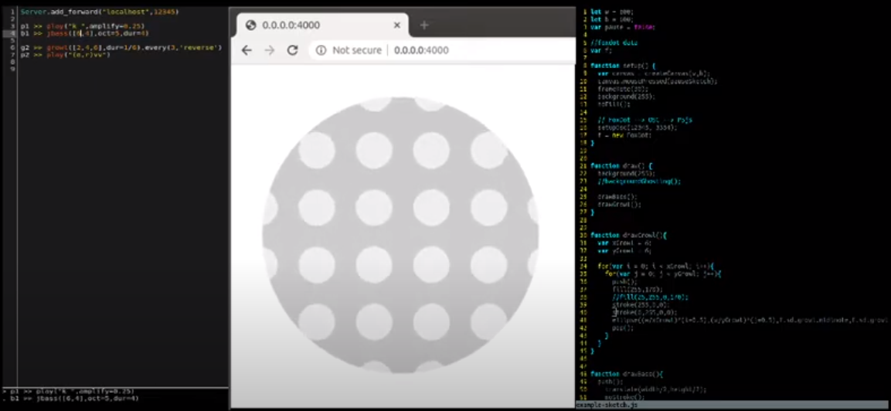

# FoxDot to P5js

A basic setup for connecting [FoxDot](https://foxdot.org/) to [P5js](https://p5js.org/). Quickly adapted from [p5js-osc](https://github.com/genekogan/p5js-osc).

[Watch a Demo](https://www.youtube.com/watch?v=xFRPgRY7IIU)

## Setup

If needed, install [node](https://nodejs.org/)

Clone this repo and install required libraries:

	$ git clone https://github.com/feature-creature/FoxDot-to-P5js
	$ cd FoxDot-to-P5js/
	$ npm install

## Run
  
Start the osc bridge. It receives OSC messages from FoxDot and sends them to p5js:

    $ node bridge.js
    
__In a new tab__, start a [lightserver](https://www.npmjs.com/package/light-server) to auto-load your livecoded p5js in a browser:

    $ cd basic-example/
    $ light-server -s . -w "**"
    
Open a browser:

    http://0.0.0.0:4000/
    
Start FoxDot with the following code to send FoxDot osc messages --> p5js bridge --> your p5js sketch
	
	Server.add_forward("localhost",12345)

	p1 >> play("k ",amplify=0.25)
	b1 >> jbass([2,6,4,8],oct=5,dur=4)

	g2 >> growl([2,4,6],dur=1/6).every(3,'reverse')
	p2 >> play("(e,r)vv")
  
Edit your FoxDot code in the FoxDot IDE and edit your P5js code in your IDE of choice and watch everything update live.
*This is a work in progress.* 
